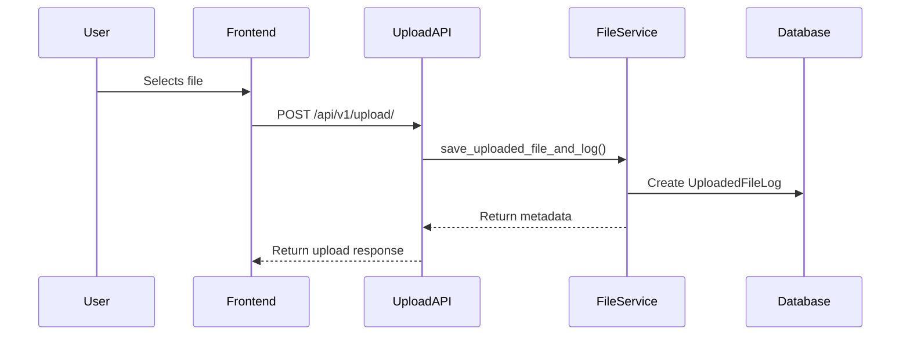
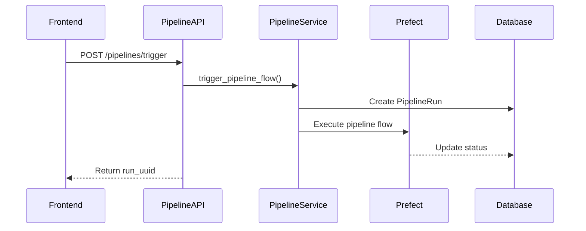
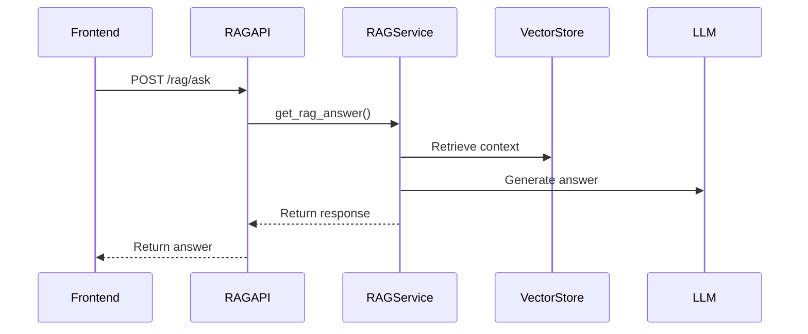

# Mini IDP - AI Workflow Platform Architecture

## Overview

The Mini IDP (Internal Developer Platform) is a self-serve platform that enables developers and data scientists to upload documents, process them through various AI pipelines (RAG chatbot, summarizer, classifier), and manage the workflow execution. The system is built with a modern, modular architecture focusing on scalability, maintainability, and user experience.

## System Components

### 1. Backend (FastAPI)

The backend is built using FastAPI and follows a clean, modular architecture:

```
app/
├── core/
│   └── config.py           # Application settings and configuration
├── routers/
│   ├── upload.py          # File upload endpoints
│   ├── pipelines.py       # Pipeline management endpoints
│   └── rag.py            # RAG-specific endpoints
├── services/
│   ├── file_service.py    # File handling business logic
│   ├── pipeline_service.py # Pipeline orchestration logic
│   └── rag_service.py     # RAG-specific business logic
├── models/
│   ├── file_models.py     # File-related data models
│   └── pipeline_models.py # Pipeline-related data models
├── db/
│   └── session.py         # Database connection management
└── main.py               # Application entry point
```

#### Key Components:

- **API Layer (Routers)**: Handles HTTP requests and route management
- **Service Layer**: Contains business logic and orchestrates operations
- **Data Layer**: Manages database operations and data models
- **Configuration**: Centralizes application settings

### 2. Frontend (React)

The frontend is built with React and follows a component-based architecture:

```
frontend/
├── src/
│   ├── components/        # Reusable UI components
│   │   ├── FileUpload
│   │   └── MultiPipelineSelector
│   ├── pages/            # Page-level components
│   │   ├── UploadPage
│   │   └── ChatPage
│   ├── services/         # API communication
│   │   └── api.js       # Backend API integration
│   └── App.jsx          # Main application component
```

#### Key Features:
- Modern React components with Storybook integration
- Centralized API service layer
- Responsive and user-friendly interface

### 3. Workflow Engine (Prefect)

The workflow orchestration is handled by Prefect:

```
workflows/
├── pipelines/
│   ├── summarizer.py     # PDF summarization pipeline
│   ├── rag_chatbot.py    # RAG chatbot pipeline
│   └── text_classifier.py # Text classification pipeline
└── orchestrator_config/  # Prefect configuration
```

## Data Flow & API Interactions

### 1. Document Upload Flow


```mermaid
sequenceDiagram
    participant User
    participant Frontend
    participant UploadAPI
    participant FileService
    participant Database

    User->>Frontend: Selects file
    Frontend->>UploadAPI: POST /api/v1/upload/
    UploadAPI->>FileService: save_uploaded_file_and_log()
    FileService->>Database: Create UploadedFileLog
    FileService-->>UploadAPI: Return metadata
    UploadAPI-->>Frontend: Return upload response
```

### 2. Pipeline Execution Flow


```mermaid
sequenceDiagram
    participant Frontend
    participant PipelineAPI
    participant PipelineService
    participant Prefect
    participant Database

    Frontend->>PipelineAPI: POST /pipelines/trigger
    PipelineAPI->>PipelineService: trigger_pipeline_flow()
    PipelineService->>Database: Create PipelineRun
    PipelineService->>Prefect: Execute pipeline flow
    Prefect-->>Database: Update status
    PipelineAPI-->>Frontend: Return run_uuid
```

### 3. RAG Chatbot Flow


```mermaid
sequenceDiagram
    participant Frontend
    participant RAGAPI
    participant RAGService
    participant VectorStore
    participant LLM

    Frontend->>RAGAPI: POST /rag/ask
    RAGAPI->>RAGService: get_rag_answer()
    RAGService->>VectorStore: Retrieve context
    RAGService->>LLM: Generate answer
    RAGService-->>RAGAPI: Return response
    RAGAPI-->>Frontend: Return answer
```

## Database Schema

### Key Tables:

1. **UploadedFileLog**
   - `id`: Primary key
   - `filename`: Original filename
   - `file_path`: Storage location
   - `file_type`: MIME type
   - `upload_timestamp`: Upload time
   - `size_bytes`: File size

2. **PipelineRun**
   - `run_uuid`: Primary key
   - `uploaded_file_log_id`: Foreign key to UploadedFileLog
   - `pipeline_type`: Enum (SUMMARIZER, RAG_CHATBOT, TEXT_CLASSIFIER)
   - `status`: Enum (QUEUED, PROCESSING, COMPLETED, FAILED)
   - `result`: JSON result data
   - `error_message`: Error details if failed
   - `created_at`: Creation timestamp
   - `updated_at`: Last update timestamp

## Security & Error Handling

1. **Input Validation**
   - File type validation
   - Size limits
   - Request payload validation using Pydantic models

2. **Error Handling**
   - Structured error responses
   - Detailed logging
   - Graceful failure handling

3. **CORS & API Security**
   - CORS middleware (configured for development)
   - Planned JWT authentication

## Deployment & Infrastructure

1. **Development Environment**
   - SQLite database
   - Local file storage
   - Uvicorn server
   - Vite development server (frontend)

2. **Production Considerations**
   - Database migration to PostgreSQL
   - Proper CORS configuration
   - Environment-specific settings
   - Docker containerization

## Future Enhancements

1. **Planned Features**
   - Dynamic pipeline parameters
   - Multi-pipeline batch operations
   - Enhanced UI/UX
   - Authentication & authorization
   - Asynchronous pipeline execution

2. **Scalability Improvements**
   - Worker scaling
   - Job queuing
   - Resource monitoring
   - Performance optimization

## Testing Strategy

1. **Backend Tests**
   - Unit tests for services
   - Integration tests for API endpoints
   - Mock database sessions
   - Pipeline execution tests

2. **Frontend Tests**
   - Component testing with Storybook
   - Integration tests
   - UI/UX testing

## Monitoring & Observability

1. **Current Implementation**
   - Basic logging
   - Pipeline status tracking
   - Error tracking

2. **Future Additions**
   - Metrics collection
   - Performance monitoring
   - User activity tracking
   - Resource usage monitoring 